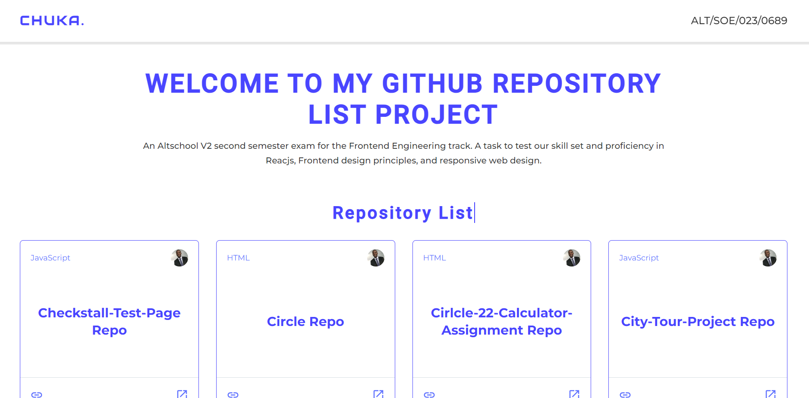
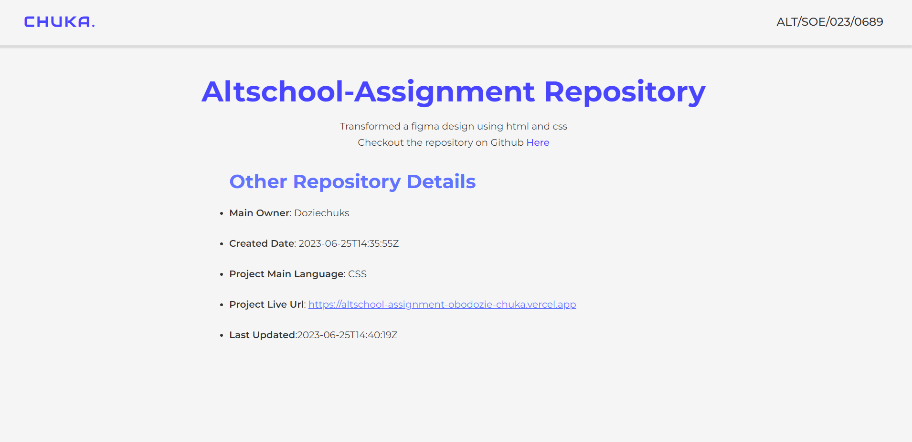

# An API Fetch Of My Github Portfolio

This is an Altschool second semester project based exam for the Verion two(2) of the Altschool Frontend Track of the school of Software engineering.

## Overview

### The challenge

The challenge in this task was to implement an API fetch of my GitHub portfolio, on the UI, I am to show a page with a list of all my repositories on GitHub, and create another page showing data for a single repo clicked from the page showing all repos using nested routes. An Error Boundary and 404 pages were also implemented.

## Built with

This project was built with Reactjs, A JavaScript Frontend Library. The styling was also completed with CSS module. The React project was setup with Vite as the build tool.

### All Repo Page:

## 

### Single Repo Page:

## Libraries used

- Axios
- React Router Dom
- Material UI

## Useful Links

- [GitHub](https://github.com/Doziechuks/Altschool-second-semester-exam)
- [Live link](https://altschool-second-semester-exam-eta.vercel.app/)
